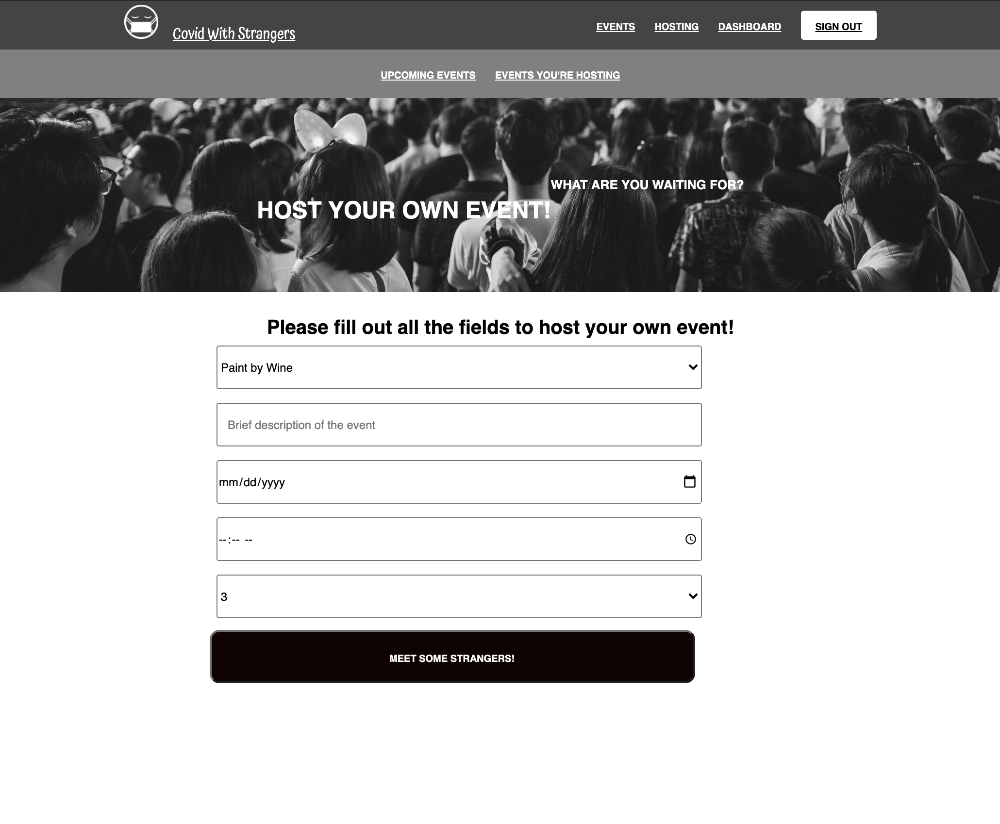
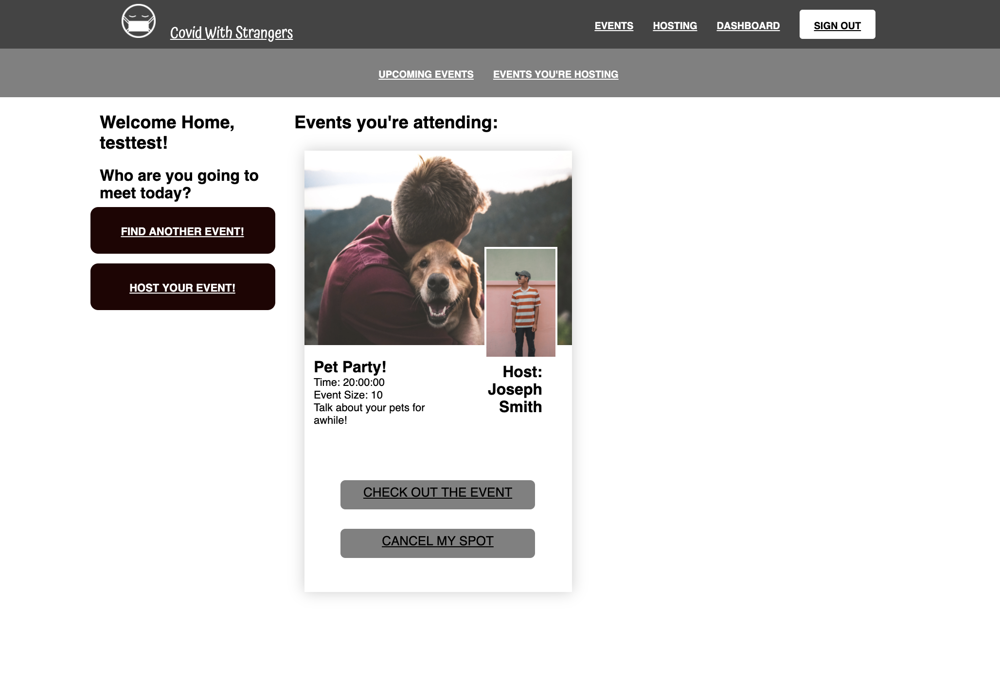

# Covid With Strangers
*by [Steven Tegnelia](https://github.com/uribgp), [Tadeo Garcia](https://github.com/tadeo-garcia)* - 
*[Visit CWS](http://covid-with-strangers.herokuapp.com)*

**Table of Contents**
* [CWS Overview](#cws-overview)
* [Features](#features)
* [Technologies Used and Sample Code](#technologies-used)


## CWS Overview

Covid With Strangers is a full stack app that facilitates making connections with new people during this pandemic. Modeled after [Tea With Strangers](http://www.teawithstrangers.com/).


## Features:

### Browse Events
Explore all of the events on the site through an easy to navigate grid of cards.


### Join Events
After you find a meeting that you'd like to learn more about, you can click on the join meeting button. This will show you details about the location, the host and a description about the meeting!


### Host Events
If you dont see a meeting that strikes your fancy, you have the option to host your own! As the host you have a variety of options to choose from in the host event form!



### Your Dashboard
From the dashboard, a user can easily view the events they are hosting or attending. If your plans change, you have the option to cancel your RSVP to an event you are attending or cancel an event you are hosting!




### Technologies Used
CWS heavily relies on the use of JavaScript as its foundation. For the front-end portion of the app it uses CSS and Pug to style and render the individual pages along JavaScript files that help add functionality to each of the elements that the user interacts with. An example of this would be selecting the form element through a query selector, which allows us to grab the user's inputs in order to create a new instance of FormData which is then sent to the backend to create a new event. The following code sample, exhibits that:

```
const hostingForm = document.querySelector('#host-form');

hostingForm.addEventListener('submit', async (e) => {
    e.preventDefault();
    
    const eventTypes = {
        'Paint by Wine': 1,
        'Green Tea':2,
        'Milkshakes': 3,
        'Share your pets': 4,
        'Oktoberfest': 5
    }

    const formData = new FormData(hostingForm);
    const _csrf = formData.get('_csrf')
    const date = new Date(formData.get('date'))
    const time = formData.get('time')
    const capacity = formData.get('capacity')
    const description = formData.get('description')

    const eventTypeId = eventTypes[formData.get('eventType')]
    const body = { _csrf, date, time, eventTypeId, capacity, description}
    const res = await fetch('/api/dashboard/hostEvent', {
        method: 'POST',
        body: JSON.stringify(body),
        headers: {
            'Content-Type': 'application/json'
        }
    });
    window.location.href = '/dashboard/hosted';
});
```

The back-end portion of the app is build around Express.js which is a minimal back-end framework for Node.js. Express allows us to keep our back-end routes simple and maintainable, which allows for a very seamless debugging process when needed. We have paired Express with a connection to a PostgreSQL database, which is the perfect relational database that we need to manage our users and their events. We were able to create several relationships among our data models, and in particular a more complex relationship that was needed given our unique case that the user model can be related to the event model as a host or as someone who attends an event. We were able to accomplish through the following code:

```
db = require("../../db/models"); const { Event, User, EventType, UserEvent } = db;

router.get('/', handleValidationErrors, routeHandler(async (req, res, next) => { 
    const events = await Event.findAll({ 
        include: [{ model: User, as: 'host' }, 
                   { model: EventType }] 
    })

res.json({ events })

}))
```

